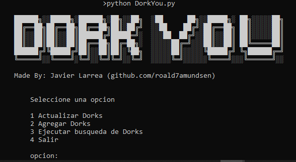

# DorkYOU


DorkYOU es un script desarrollado en Python 3, el cual contiene los mas de  6500  dorks querys en constante crecimiento, definidos en Google Hacking Database  "https://www.exploit-db.com/google-hacking-database". 
Mediante una automatización esta herramienta te permitirá realizar búsquedas de información sensible, portales de login, dispositivos en linea, etc. Accesibles desde internet con el simple uso de motor de búsqueda como lo es Google.

# Características!

  - Sin necesidad de usar proxys externos para evación de captchas.
  - Performance superior.
  - Uso intuitivo
  - Compatible con linux, windows y MacOs

# Requisitos!
Hardware:
  - Conexión estable a internet 
  - Procesador Intel Core i5 2.5 GHZ o equivalente
  - Memoria RAM de 4 Gb
  
Software:
  - Python 3
  - Cuenta de google


### Instalación

Instalación de dependencias.

```sh
$ sudo git clone https://github.com/Roald7Amundsen/DorkYou
$ cd DorkYou
$ pip install -r requirements.txt
```
# USO

```sh
$ python DorkYou.py
```


***
#### Actualizar Dorks

Simplemente se añadirán los nuevos query dorks que han sido definidos en Google Hacking Database


***

#### Agregar Dorks

Puedes agregar Dorks personalizados.


***

#### Ejecutar Búsqueda de Dorks

He aquí el corazón del aplicativo, para realizar búsquedas puntuales sobre un dominio y evitar bloqueos, requerirás una cuenta de google para crear un buscador personalizado en custom search engine "https://cse.google.com/cse/all", debes generar 2 CSE identicos en los cuales se vean involucrados los dominios de interes, pudiento limitar los resultados por idioma en caso de requerirse.


Aquí es donde se define el o los dominios de búsqueda objetivo, pudiendo limitar el idioma de los resultados obtenidos.


Finalmente se obtiene el enlace público CSE.


Este proceso se debe ejecutar de manera idéntica, obteniendo finalmente 2 enlaces CSE relacionados con los dominios objetivo de búsqueda.
***


Una vez ingresadas las cadenas CSE se da paso a la búsqueda por categorías.
***
##### Importante: Cierra los navegadores web que tengas abiertos para evitar conflictos de inicialización y depuración de instancias de agentes de navegación del aplicativo DorkYou.

***
.
| opción | Categoría | categoría de GHDB | 
| ------ | ------ | ------ |
| 1 | usuarios y passwords | Files Containing Usernames GHDB Google Dork | 
||  | Files Containing Passwords GHDB Google Dork |
||  | Files Containing Passwords GHDB Google Dork |
| 2 | directorios sensibles | Sensitive Directories GHDB Google Dork |
| 3 | portales de login | Pages Containing Login Portals GHDB Google Dork |
| 4 | dispositivos en linea | Various Online Devices GHDB Google Dork |
| 5| servidores y directorios vulnerables | Vulnerable Files GHDB Google Dork |
||  | Vulnerable Servers GHDB Google Dork |
||  | Advisories and Vulnerabilities GHDB Google Dork |
|6| escaneos de vulnerabilidades | Network or Vulnerability Data GHDB Google Dork |
|7| Información sensible | Files Containing Juicy Info GHDB Google Dork |
||  | Web Server Detection GHDB Google Dork |
||  | Error Messages GHDB Google Dork |
||  | Footholds GHDB Google Dork |
| | | Sensitive Online Shopping Info GHDB Google Dork |
|8| Dorks personalizados | N/A |

Mientras se realiza la búsqueda tendrás una barra de estado indicandote el avance de la tarea y el tiempo restante aproximado.


En cuando finalice tendrás un archivo XML con todos los Dorks que han arrojado resultados y sus enlaces correspondientes


Eso es todo!!!, disfrutalo
